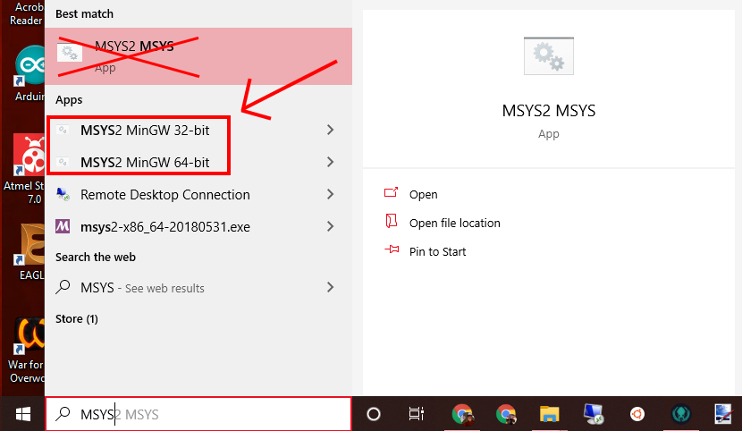
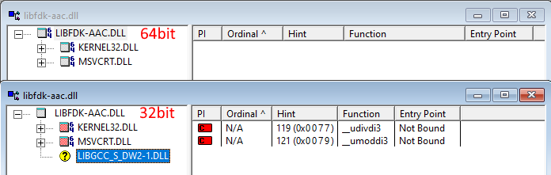

# libfdk-aac for Windows binary builder

libfdk-aac (0.1.6 and 2.0.1) and fdkaac tool for Windows auto binary builder scripts.

[fdk-aac](https://github.com/mstorsjo/fdk-aac) is "A standalone library of the Fraunhofer FDK AAC code from Android."

[fdkaac](https://github.com/nu774/fdkaac) is "command line encoder frontend for libfdk-aac".

It'll build both:

* `libfdk-aac-1.dll`
* `libfdk-acc-2.dll`
* `fdkaac.exe` (Linked libfdk-aac-2.dll)

# How to use

1. Install [MSYS2](http://www.msys2.org/)
2. Open MSYS2 shell terminal.
  * Choose `MSYS2 MinGW-32bit` terminal if you wanna 32bit (i686) binary.
  * Choose `MSYS2 MinGW-64bit` terminal if you wanna 64bit (x86_64) binary.
  * DON'T USE `MSYS2` (unannoteted) terminal.
  
  
  
3. Update components by pacman. (See MSYS2 top page.)
4. Install development tools.
  * Execute `pacman -S mingw-w64-i686-gcc autoconf automake-wrapper make` if you wanna 32bit binary.
  * Execute `pacman -S mingw-w64-x86_64-gcc autoconf automake-wrapper make` if you wanna 64bit binary.
5. Execute `./download.sh`, it'll download fdk-aac archive from [official opencore-amr project](https://sourceforge.net/projects/opencore-amr/) mirror.
6. Execute `./build.sh`.

Finally, stored binaries into artifacts directory.
  * `artifacts/i686-w64-mingw32/` (32bit)
  * `artifacts/x86_64-w64-mingw32/` (64bit)

# Limitation

Unfortunately, 32bit binaries referenced MinGW32 gcc depending library named `libgcc_s_dw2-1.dll` and `libwinpthread-1.dll`. Because fdk-aac use dividing operator, it requires implicitly asynchronous exception handler contains into it.

(It doesn't apply for 64bit binaries.)

# License

MIT, inside all contents except built binaries. See description for fdk-aac.
